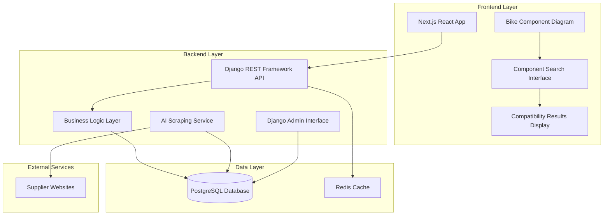

# Design Document

## Overview

The Component Compatibility System is a web-based application that provides real-time compatibility checking between bicycle components. The system uses a color-coded visual feedback system (green/orange/red) to indicate compatibility status and supports both frame-centric workflows and direct component-to-component comparisons.

The architecture follows a modern web application pattern with a Next.js (React) frontend, Django with Django REST Framework backend, and PostgreSQL database. The system includes an AI agent for automated web scraping and data collection, plus an admin interface for manual data management.

## Architecture

### System Architecture Diagram



### Technology Stack

- **Frontend**: Next.js 14+ with React 18, TypeScript, Tailwind CSS
- **Backend**: Django 4.2+ with Django REST Framework
- **Database**: PostgreSQL 15+
- **Caching**: Redis for API response caching
- **AI Scraping**: Python-based web scraping with BeautifulSoup/Scrapy
- **Deployment**: Docker containers for development and production

## Components and Interfaces

### Frontend Components

#### 1. Interactive Bike Diagram Component
```typescript
interface BikeComponentArea {
  id: string;
  name: string;
  coordinates: { x: number; y: number; width: number; height: number };
  category: ComponentCategory;
  isSelected: boolean;
  compatibilityStatus?: 'compatible' | 'conditional' | 'incompatible';
}

interface BikeComponentDiagramProps {
  selectedComponents: SelectedComponent[];
  onComponentClick: (area: BikeComponentArea) => void;
  onComponentHover: (area: BikeComponentArea | null) => void;
}
```

#### 2. Component Search Interface
```typescript
interface ComponentSearchProps {
  category: ComponentCategory;
  onComponentSelect: (component: Component) => void;
  compatibilityFilter?: Component; // For filtering compatible components
}

interface SearchFilters {
  brand?: string;
  priceRange?: [number, number];
  specifications?: Record<string, string>;
}
```

#### 3. Compatibility Display Component
```typescript
interface CompatibilityResult {
  status: 'compatible' | 'conditional' | 'incompatible';
  confidence: number;
  explanation: string;
  requiredAdapters?: Adapter[];
  alternativeSuggestions?: Component[];
}

interface CompatibilityDisplayProps {
  result: CompatibilityResult;
  components: [Component, Component];
}
```

### Backend API Endpoints

#### Core API Structure
```python
# Django REST Framework ViewSets
class ComponentViewSet(viewsets.ModelViewSet):
    """CRUD operations for components with filtering and search"""
    
class FrameViewSet(viewsets.ModelViewSet):
    """CRUD operations for bike frames"""
    
class CompatibilityCheckView(APIView):
    """POST endpoint for checking compatibility between components"""
    
class ComponentSearchView(APIView):
    """GET endpoint with advanced search and filtering"""
```

#### API Endpoints
- `GET /api/components/` - List components with filtering
- `GET /api/components/{id}/` - Get specific component details
- `GET /api/frames/` - List bike frames
- `POST /api/compatibility/check/` - Check compatibility between components
- `GET /api/components/search/` - Advanced component search
- `GET /api/standards/` - List all compatibility standards

## Data Models

### Core Database Schema

```python
# Django Models
class Standard(models.Model):
    """Mechanical standards (BB types, axle standards, etc.)"""
    name = models.CharField(max_length=100)
    category = models.CharField(max_length=50)
    description = models.TextField()
    specifications = models.JSONField()

class Frame(models.Model):
    """Bike frame specifications"""
    brand = models.CharField(max_length=100)
    model = models.CharField(max_length=100)
    year = models.IntegerField()
    bottom_bracket_standard = models.ForeignKey(Standard)
    rear_axle_standard = models.ForeignKey(Standard)
    brake_mount_standard = models.ForeignKey(Standard)
    headtube_standard = models.ForeignKey(Standard)
    seatpost_diameter = models.DecimalField(max_digits=5, decimal_places=2)

class Component(models.Model):
    """Individual bike components"""
    name = models.CharField(max_length=200)
    brand = models.CharField(max_length=100)
    category = models.CharField(max_length=50, choices=COMPONENT_CATEGORIES)
    specifications = models.JSONField()
    compatible_standards = models.ManyToManyField(Standard)
    price_range = models.CharField(max_length=50, null=True)

class CompatibilityRule(models.Model):
    """Explicit compatibility rules between components/standards"""
    component_a = models.ForeignKey(Component, related_name='compatibility_a')
    component_b = models.ForeignKey(Component, related_name='compatibility_b')
    status = models.CharField(max_length=20, choices=COMPATIBILITY_STATUS)
    confidence = models.DecimalField(max_digits=3, decimal_places=2)
    explanation = models.TextField()
    required_adapters = models.ManyToManyField('Adapter', blank=True)
```

### Component Categories and Specifications

```python
COMPONENT_CATEGORIES = [
    ('bottom_bracket', 'Bottom Bracket & Crankset'),
    ('cassette_derailleur', 'Cassette & Derailleur'),
    ('brake_system', 'Brake System'),
    ('wheel_frame', 'Wheel & Frame Interface'),
    ('seatpost', 'Seatpost & Frame'),
]

# Category-specific specification schemas
SPECIFICATION_SCHEMAS = {
    'bottom_bracket': {
        'spindle_type': str,
        'shell_width': float,
        'standard': str,  # BSA, BB30, DUB, etc.
        'thread_pitch': str,
    },
    'cassette_derailleur': {
        'gear_range': str,
        'spacing': str,
        'pull_ratio': str,
        'speed_count': int,
        'brand_compatibility': list,
    },
    'brake_system': {
        'type': str,  # mechanical, hydraulic
        'mounting_standard': str,
        'rotor_size': list,
        'brand': str,
        'actuation_type': str,
    },
    'wheel_frame': {
        'axle_type': str,  # quick_release, thru_axle
        'spacing': float,  # 135mm, 142mm, etc.
        'rotor_mounting': str,  # centerlock, 6_bolt
        'hub_standard': str,
    },
    'seatpost': {
        'diameter': float,
        'insertion_length': float,
        'saddle_clamp_type': str,
        'material': str,
    }
}
```

## Error Handling

### Frontend Error Handling
- Network error handling with retry mechanisms
- User-friendly error messages for compatibility check failures
- Loading states during API calls
- Graceful degradation when components fail to load

### Backend Error Handling
```python
class CompatibilityAPIException(APIException):
    """Custom exception for compatibility check errors"""
    status_code = 400
    default_detail = 'Compatibility check failed'

class ComponentNotFoundError(APIException):
    status_code = 404
    default_detail = 'Component not found'

# Error response format
{
    "error": {
        "code": "COMPATIBILITY_CHECK_FAILED",
        "message": "Unable to determine compatibility",
        "details": "Missing specification data for component X"
    }
}
```

## Testing Strategy

### Frontend Testing
- **Unit Tests**: Jest + React Testing Library for component logic
- **Integration Tests**: Testing component interactions and API calls
- **E2E Tests**: Cypress for full user workflow testing
- **Visual Regression Tests**: Chromatic for UI consistency

### Backend Testing
- **Unit Tests**: Django TestCase for model and business logic
- **API Tests**: Django REST Framework APITestCase for endpoint testing
- **Integration Tests**: Database integration and external service mocking
- **Performance Tests**: Load testing for compatibility check endpoints

### Test Coverage Requirements
- Minimum 80% code coverage for backend
- Minimum 70% code coverage for frontend
- 100% coverage for critical compatibility logic

### Key Test Scenarios
1. **Compatibility Logic Tests**
   - Compatible component combinations
   - Incompatible component combinations
   - Conditional compatibility with adapters
   - Edge cases and error conditions

2. **User Interface Tests**
   - Bike diagram interaction
   - Component search and selection
   - Color-coded compatibility display
   - Responsive design across devices

3. **Data Integrity Tests**
   - Component specification validation
   - Compatibility rule consistency
   - AI scraping data validation
   - Admin interface data management

## Performance Considerations

### Frontend Optimization
- Component lazy loading for large component lists
- Image optimization for bike diagrams
- Debounced search input to reduce API calls
- Client-side caching of frequently accessed data

### Backend Optimization
- Database indexing on frequently queried fields
- Redis caching for compatibility check results
- Pagination for large component lists
- Optimized database queries with select_related/prefetch_related

### Scalability Planning
- Horizontal scaling capability for API servers
- Database read replicas for improved read performance
- CDN integration for static assets
- Monitoring and alerting for performance metrics