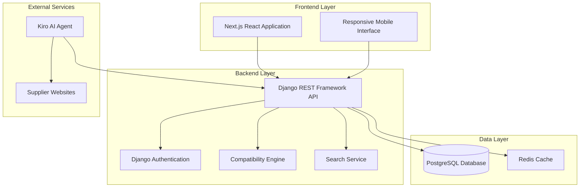

# Design Document

## Overview

The Component Compatibility System is a web-based application that provides real-time compatibility checking between bicycle components. The system uses a color-coded visual feedback system (green/orange/red) to indicate compatibility status and supports both frame-centric workflows and direct component-to-component comparisons.

The architecture follows a modern web application pattern with a Next.js (React) frontend, Django with Django REST Framework backend, and PostgreSQL database. The system includes Kiro, an AI agent for automated web scraping and data collection, plus an admin interface for manual data management.

## Architecture

### High-Level Architecture



### Design Decisions and Rationales

**Frontend Technology Choice**: Next.js with React and TypeScript
- **Rationale**: Provides excellent component reusability for the color-coded compatibility indicators, server-side rendering for better SEO and performance, strong ecosystem for responsive design, and TypeScript ensures type safety for complex compatibility logic.

**Backend Technology Choice**: Django with Django REST Framework
- **Rationale**: Robust ORM for complex component relationships, built-in admin interface for data management, excellent authentication and permissions system, and strong ecosystem for web scraping integration with Python libraries.

**Database Choice**: PostgreSQL
- **Rationale**: Excellent support for complex relationships between components, JSONB fields for flexible component specifications, and strong consistency for compatibility rules.

**Caching Strategy**: Redis for compatibility results
- **Rationale**: Compatibility calculations can be expensive, and results are frequently accessed. Redis provides sub-second response times for repeated queries.

## Components and Interfaces

### Frontend Components

#### Core UI Components
- **FrameSelector**: Handles frame selection with search and filtering
- **ComponentBrowser**: Displays components with color-coded compatibility
- **CompatibilityIndicator**: Reusable component for green/orange/red status display
- **SearchBar**: Auto-complete search functionality
- **ComparisonView**: Direct component-to-component comparison interface

#### Layout Components
- **ResponsiveLayout**: Adapts interface for desktop/tablet/mobile
- **NavigationBar**: Main application navigation
- **AdminPanel**: Administrative interface for data management

### Backend Services

#### API Endpoints
```
GET /api/frames - List and search frames
GET /api/components/:category - List components by category
POST /api/compatibility/check - Check compatibility between components
GET /api/compatibility/frame/:frameId - Get all compatibilities for a frame
POST /api/admin/components - Add/edit components (admin only)
POST /api/admin/compatibility-rules - Manage compatibility rules
```

#### Core Services
- **CompatibilityEngine**: Central service for compatibility calculations
- **ComponentService**: CRUD operations for components and frames
- **SearchService**: Handles search and filtering logic
- **ScrapingService**: Manages AI web scraper integration
- **ValidationService**: Validates compatibility rules and component data

### Data Models

#### Component Model
```typescript
interface Component {
  id: string;
  type: ComponentType;
  brand: string;
  model: string;
  specifications: Record<string, any>;
  compatibilityRules: CompatibilityRule[];
  createdAt: Date;
  updatedAt: Date;
}
```

#### Frame Model
```typescript
interface Frame extends Component {
  type: 'frame';
  frameSize: string;
  material: string;
  geometry: FrameGeometry;
  mountingStandards: MountingStandard[];
}
```

#### Compatibility Rule Model
```typescript
interface CompatibilityRule {
  id: string;
  sourceComponentId: string;
  targetComponentId: string;
  status: 'compatible' | 'conditional' | 'incompatible';
  conditions?: string[];
  explanation: string;
  confidence: number;
}
```

## Data Models

### Database Schema

#### Components Table
- Primary storage for all bicycle components including frames
- JSONB field for flexible specification storage
- Indexed on brand, model, and component type for fast searching

#### Compatibility Rules Table
- Stores relationships between components
- Supports both specific component pairs and pattern-based rules
- Includes confidence scoring for AI-generated rules

#### Scraping Queue Table
- Manages automated data collection tasks
- Tracks scraping status and validation results
- Stores conflict resolution data

### Compatibility Logic

The compatibility engine uses a multi-layered approach:

1. **Direct Rules**: Explicit compatibility relationships stored in the database
2. **Pattern Matching**: Rules based on component specifications and standards
3. **AI Inference**: Machine learning models for uncertain compatibility cases
4. **Fallback Logic**: Conservative "conditional" status when certainty is low

## Error Handling

### Frontend Error Handling
- **Network Errors**: Graceful degradation with retry mechanisms
- **Validation Errors**: Real-time form validation with clear error messages
- **Compatibility Errors**: Fallback to "uncertain" status with explanatory text

### Backend Error Handling
- **Database Errors**: Connection pooling with automatic retry
- **Scraping Errors**: Queue-based retry system with exponential backoff
- **Validation Errors**: Comprehensive input validation with detailed error responses
- **Rate Limiting**: Prevents abuse while maintaining performance

### Data Integrity
- **Compatibility Rule Validation**: Prevents circular dependencies and conflicting rules
- **Component Data Validation**: Ensures required specifications are present
- **Scraping Data Validation**: AI-scraped data requires admin approval before integration

## Testing Strategy

### Unit Testing
- **Frontend**: Jest and React Testing Library for component testing
- **Backend**: Jest for service and utility function testing
- **Database**: Isolated test database with transaction rollback

### Integration Testing
- **API Testing**: Supertest for endpoint testing with real database
- **Compatibility Engine**: Comprehensive test cases for all compatibility scenarios
- **Scraping Integration**: Mock external services for reliable testing

### End-to-End Testing
- **User Workflows**: Cypress tests for complete user journeys
- **Responsive Design**: Cross-device testing for mobile compatibility
- **Performance Testing**: Load testing for compatibility calculation performance

### Performance Requirements
- **Compatibility Checks**: Sub-1-second response time for individual checks
- **Component Loading**: Progressive loading for large component lists
- **Search Performance**: Real-time search results with debounced queries
- **Mobile Performance**: Optimized bundle size and lazy loading

### Monitoring and Analytics
- **Performance Monitoring**: Track compatibility check response times
- **Error Tracking**: Comprehensive error logging and alerting
- **Usage Analytics**: Track popular components and compatibility patterns
- **Scraping Monitoring**: Monitor data collection success rates and quality